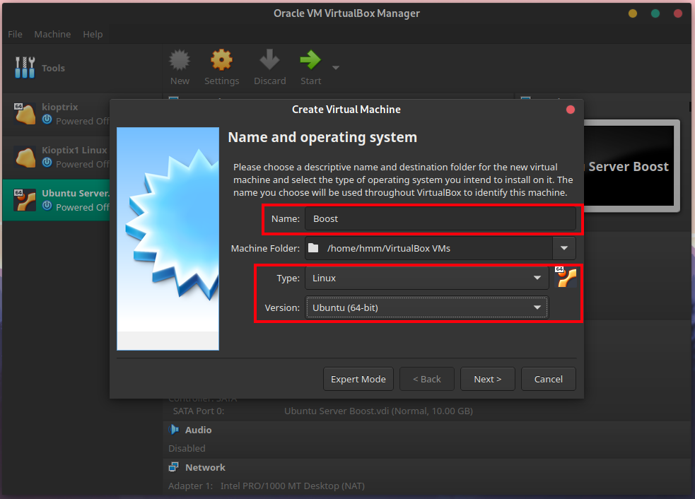
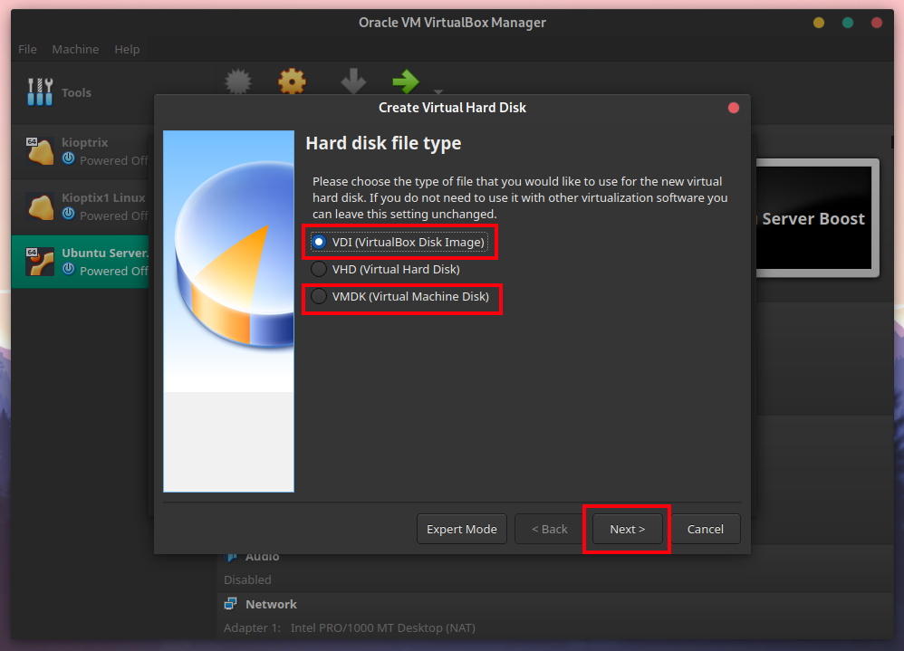
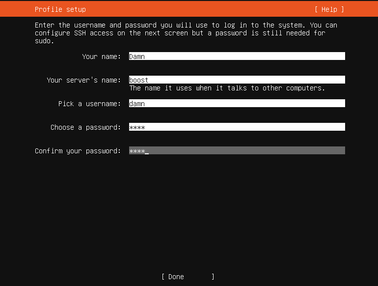

# WEEK 1: Ubuntu Server Installation

## Agenda:

> To learn how to install Linux onto a virtual machine. Here we are going
to install Ubuntu Server 22.04 LTS version. After, Installing Ubuntu
Server try to install different operating system in virtual machines as
a challenge or a fun task.

Before we start you need to download a couple of resources which are
mentioned below once the download is completed follow the steps.

## Requirements:

There are a couple of thing you will need to get started:

1. [Ubuntu][1]
1. [Virtual Box][2]

## Steps:

Once you have installed Virtual box fire it up and let get going. First
you need to click on new which will create a new virtual machine.

Give a name to your Virtual Machine (VM). Choose type as Linux as we are
installing Ubuntu which is a Linux Operating System. Also make sure you
have selected version as Ubuntu 64-Bit. Then click on next.

Now we need to set memory size for your virtual machine. Note that this
virtual machine will share your host system hardware resources. I would
also recommend 1 to 2GB of RAM for better performance. Then click on
Next and let us continue.

Keep everything default and click on next this step will create a new
virtual hard disk. Go to the next screen.

For creating your virtual hard disk you can select VDI, VHD or VMDK. The
most important one's are VDI and VMDK. VDI is VirtualBox's own Disk
Imaging system. One of main advantages of using VMDK image system is
that you can share your virtaul machine disk image use it different
software like VMware. Click on Next to continue with the process.

There are two types of allocations:

**Dynamic Allocation:**

> The storage will expand as it fills up. This is very useful as you
> don't need to manage your allocation size.

**Fixed Sized Allocation:**
> In Fixed size allocation once you reach the maximum limit you have set
> you cannot expand it.

**NOTE:** If you don't know what to choose I will recommend you to use dynamic
allocation.

You can allocate 10GB or Bump it up 20GB if you feel necessary. I am
just gonna go with 10GB here. Click on Create.

After this a machine will be created and will be available in the left
hand side pane (Number 1). Click on your virtual machine and then
click on start (Number 2 and remember don't click on the arrow).

Once you booted the VM. A popup with file icon will appear click on it.
This will bring another pop up in which you will need to add your `.iso`
file. Click on Add. Browse through your files and select your Ubuntu
image.

Once you have opened the Ubuntu image select it and choose to image to
attach to the VM.

Once attached the image make sure you have attached the correct `.iso`
file. If everything is good then click on start and this will start your
Ubuntu live environment.

:warning: **Warning**:
> To move your cursor or capture your keyboard inputs you need to click
> within the Ubuntu VM. This is will start capturing your inputs. Also
> note during that you won't be able to access your host machine unless
> you press RIGHT CTRL KEY on your keyboard. This will detach you and
> you will be able to access your host machine.

Let the VM boot it take some good amount of time depending on your
computer processing power. Once booted Select your preferred language
and continue.

Choose your keyboard layout. I am just gonna go with defaults.

Just go with defaults, if you want you can even opt for minimized
version if you know what you are doing.

For the next 4 screen you just need to go with defaults. Here we are
setting up our network using DHCP protocol.

This is mostly used in Enterprise to set up proxy outside of the
companies VPN.

Make sure it says 10 or 20GB which you choose earlier.

The Block 1 shows the File system summary.
The Block 2 shows us which device is being used.
The Block 3 shows the partition on how your hard disk's space is being
divided.

This will delete the data stored on your virtual disk. As we created
virtual disk it is not going to affect your host operating system or
data. So just continue.

Once partition is completed, you will be asked to set your username,
server name, and your password. You won't be able to change your server
name later. So make sure to pick the one you like. Just keep it
alphanumeric.

> :warning: **Make Sure to note your username and password as you will
require it for login.**

Once completed with the account settings. You will be given the option
to install some software. This is completely optional so I am just gonna
leave it right there and continue.

Wait until the process is finished. It will say reboot now press enter.
Wait for a couple of minute and it should say `FAILED: ...` something
along the lines just press `Enter` and it will reboot. Use your username
and password to log into the account.  There you go you have
successfully completed your Ubuntu Server 22.04 Installation.

🙂 Hope this helps!

**Author Name:** Dharmit Shah

**Github Profile:** [ Dharmit009 ](https://github.com/dharmit009)

[1]: https://ubuntu.com/download/server
[2]: https://www.virtualbox.org/

